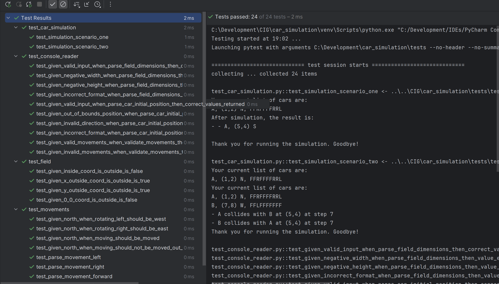

# Installation

- Install Python 3.12 or higher (you can try with a lower version, but if you face any difficulties, install this
  version)
- Open a terminal and navigate to your project directory, e.g. ```C:/my_projects/car_simulation```
- Create a virtual env by executing ```python -m venv venv```
- Activate the Virtual Environment ```venv\Scripts\activate```
- Install Dependencies ```pip install -r requirements.txt```

# Setup IDE

- The recommended IDE is PyCharm
- Create the virtual env as described in installation and set this as local interpreter
- Use your IDE to run the tests and the application. It is much easier than in the command line. If you prefer the
  command line anyway please see the chapters below.

# Execute tests

- Navigate to the root directory of your project , e.g. ```C:/my_projects/car_simulation```
- Set the PYTHONPATH to src and tests. Please note, depending on your shell or os system this might be different. The
  example is for a Windows Command prompt ```$env:PYTHONPATH="src;tests"```
- Execute ```pytest```

### Test results


# Run the application

- Make sure your virtual env is activated: ```venv\Scripts\activate```
- Set the PYTHONPATH: ```$env:PYTHONPATH="src;tests"```
- Run the main: ```python src/main.py```

# Design

- Although Python allows to have multiple classes within a file, I went the 'Java way' and mostly used 1 class per file.
  This reduces problems with dependency cycles and makes the Open Closed principle a bit more explicit as you really add
  new files and not change existing files (although you technically only add code).
- The Car class is a composition with Movements. This follows the open closed and Single Responsibility design
  principle. You can easily add new types of Movement like a MoveBackward with minimal modification of code.
- The reader was extracted as the console is always tough to test. Although you can somehow mock it, it is a cleaner
  way, also from a Single Responsibility point of view.
- The SimulationResult is rather kept simple in order to not overengineer it. Depending on further requirements it can
  be re-designed at a later stage where the new requirements are clear.
